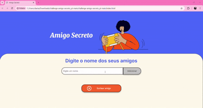

# 🎁 Challenge Amigo Secreto 🎁


Este projeto foi desenvolvido para o **Challenge Amigo Secreto**, etapa final da formação **Iniciante em Programação G8 – ONE**, do programa **ONE - Oracle Next Education**. O programa da Oracle tem como objetivo capacitar pessoas em tecnologia e conectá-las com o mercado de trabalho por meio de empresas parceiras.

---

## 📚 Sumário


- [Sobre o projeto](#-sobre-o-projeto)
- [Funcionalidades](#-funcionalidades)
- [Estrutura do projeto](#%EF%B8%8F-estrutura-do-projeto)
- [Tecnologias utilizadas](#%EF%B8%8F-tecnologias-utilizadas)
- [Como executar](#-como-executar)
- [Demonstração](#-demonstração)
- [Considerações finais](#-considerações-finais)

---

## 💡 Sobre o projeto

O desafio tem como objetivo colocar em prática conceitos fundamentais de lógica de programação, tais como:

- **Variáveis**
- **Condicionais**
- **Funções**
- **Listas**
- **Loops de repetição**

A aplicação desenvolvida permite que o usuário insira nomes de amigos em uma lista e realize um sorteio aleatório para definir o "amigo secreto".

---

## 🚀 Funcionalidades

- **Adicionar nomes:**  
  Permite inserir o nome de um amigo por meio de um campo de texto e adicioná-lo à lista utilizando o botão **Adicionar**.

- **Validação de entrada:**  
  - Se o campo de texto estiver vazio, o sistema exibirá um alerta.
  - Se o nome já tiver sido adicionado, um alerta avisará sobre a duplicidade.

- **Visualização da lista:**  
  Os nomes adicionados são exibidos em uma lista na página, facilitando a conferência dos participantes.

- **Sorteio aleatório:**  
  Ao clicar no botão **Sortear amigo**, a aplicação seleciona aleatoriamente um nome da lista e exibe o resultado. Após o sorteio, a lista é limpa para permitir um novo sorteio.

---

## 🗂️ Estrutura do projeto

```
.
├── assets
│   ├── amigo-secreto.png
│   └── play_circle_outline.png
├── gifs
│   └── challenge.gif
├── index.html
├── style.css
└── app.js
```

- **assets/**  
  Contém as imagens utilizadas na interface.

- **gifs/**  
  Contém o gif de demonstração usado no README.md.

- **index.html:**  
  Estrutura da página com os elementos de input, lista de amigos e botão para sorteio. 

- **style.css:**  
  Responsável pela estilização e layout da interface.

- **app.js:**  
  Implementa a lógica de negócio: validação, adição de nomes, atualização da lista e realização do sorteio aleatório.  

---

## 🛠️ Tecnologias utilizadas

- **HTML5:** Estrutura da aplicação.
- **CSS3:** Estilização e layout.
- **JavaScript:** Lógica de programação e manipulação de elementos DOM.

---

## 🔄 Como Executar

1. **Clone o repositório ou faça o download:**
   ```bash
   git clone https://github.com/debedantas/Challenge-Amigo-Secreto-ONE
   ```
2. **Abra o arquivo `index.html` no seu navegador escolhido.**
3. **Interaja com a aplicação:**
   - Insira nomes no campo de texto e clique em **Adicionar**.
   - Visualize a lista de amigos.
   - Clique em **Sortear amigo** para realizar o sorteio aleatório.

---

## 🎬 Demonstração

No gif abaixo você pode ver uma demonstração rápida do site:



---

## 📝 Considerações finais

Este projeto foi desenvolvido para demonstrar a aplicação prática de conceitos básicos de programação em um cenário interativo. Ele serve como um exercício de aprendizado e como uma ferramenta para mostrar como lógica e manipulação de dados podem ser utilizados na construção de aplicações web.

*Desenvolvido como desafio final da formação "Iniciante em Programação G8" – Oracle ONE Next Education.*

---

Valeu! 🚀